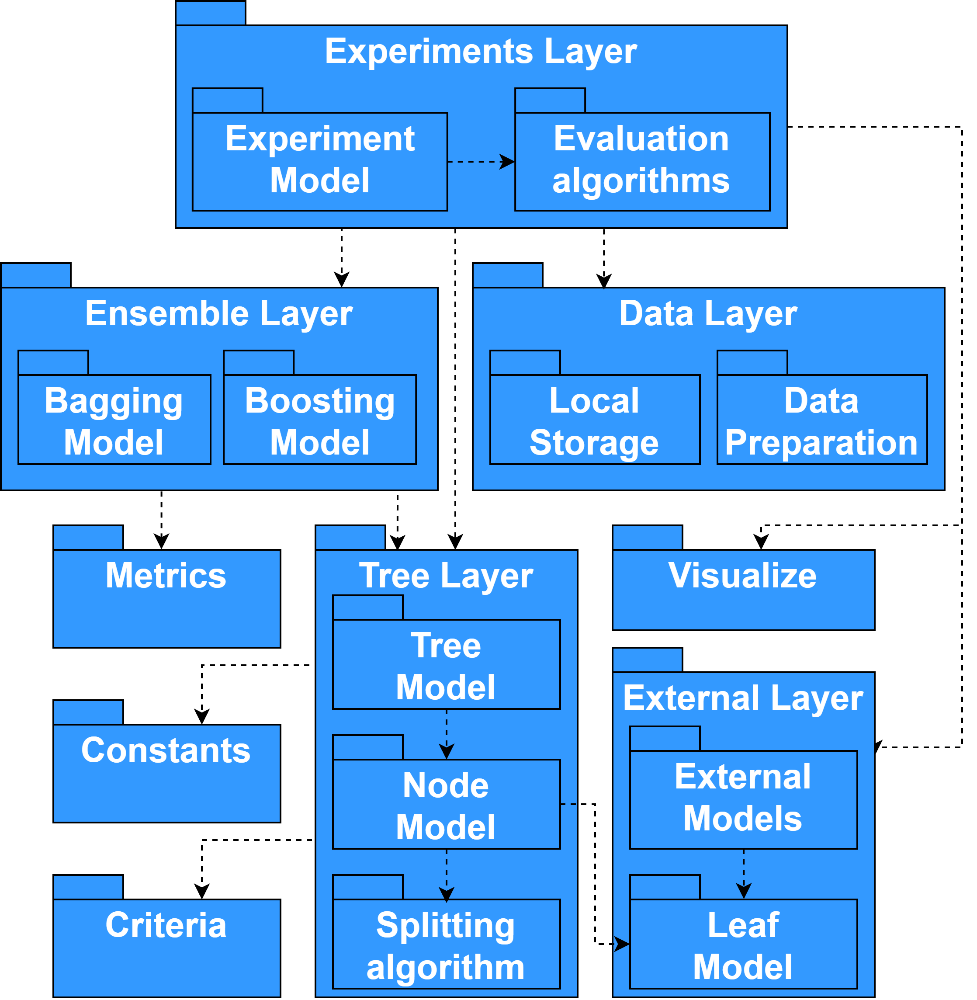

Component description
=====================

1. **Internal representation module** (:doc:`modules/Constants`):

   The module contains constants (names of target variables and dictionaries for displaying input parameters) and functions (splitting input data by type of variable, constructing a target variable, binarization a temporary variable) necessary for working with internal data representation and predictive models.

   Used libraries: os, numpy; length - 200 lines.

2. **Quality metrics module** (:doc:`modules/Metrics`):

   The module contains implementations of the classic survival analysis metrics *Concordance Index*, *Likelihood*, *Brier score*, *Integrated Brier Score*, *Integrated AUC*, *AUPRC*, as well as their modifications (for example, *IBS \_WW*, *IBS\_REMAIN*, *IBS\_BAL*), developed while studying cases of excessive sensitivity of metrics.

   Used libraries: pandas, lifelines; length - 300 lines.
   The numba and joblib libraries were used to parallelize and vectorize calculations.

3. **Statistical criteria module** (:doc:`modules/Criteria`):

   The module contains vectorized implementations of statistical criteria: Log-rank, Wilcoxon, Tarone-Ware, Peto-Peto, MaxCombo, etc. Computations are accelerated by using JIT compilation of source code into bytecode using the Numba library.

   Used libraries: numpy, scipy, numba; length - 600 lines.

4. **Visualization module** (:doc:`modules/Visualize`):

   The module contains functions for demonstrating the results of algorithms in a user-friendly format. The following groups of functions can be distinguished: display of survival analysis forecasts, analysis of the behavior of quality metrics, and visualization of data characteristics.

   Used libraries: pandas, numpy, matplotlib, seaborn; length - 1000 lines.

5. **External models module** (:doc:`modules/External`):

   The module contains implementations of existing survival analysis models with a unified LeafModel interface. Models with the LeafModel interface can be used both to conduct experiments and to describe leaf sampling in a survival tree.
   The module implements non-parametric Kaplan-Meier, and Nelson-Aalen models and their modifications, as well as wrappers for lifelines library models: KaplanMeierFitter, NelsonAalenFitter, WeibullAFT, LogNormalAFT, LogLogisticAFT.

   Used libraries: numpy, lifelines; length - 400 lines.

6. **Module for constructing a survival tree** (:doc:`modules/Tree`):

   The module contains a description of the main entities (Node vertex class, CRAID survival tree class), implementation of the proposed methods for selecting the best partitioning of the sample, and constructing tree models.
   The Node class is responsible for the individual structural elements of the survival tree (using the LeafModel class) and for finding the optimal splitting rule of the node.
   The CRAID class defines the structure of a survival tree (with hyperparameter-based control of tree growth) and contains methods for pruning the tree and aggregating leaf model predictions.

   Used libraries: pandas, sklearn, scipy, numba, and joblib; length - 1800 lines.

7. **Module for constructing ensembles of decision trees** (:doc:`modules/Ensemble`):

   The module contains a base class for ensembling survival trees, BaseEnsemble, and an implementation of the interface in the form of a model for an ensemble of independent survival trees, BootstrapCRAID. The models contain methods for calculating the ensemble error, aggregating the responses of the base models, and selecting the best ensemble size.

   Used libraries: pandas, sklearn, scipy; length - 1000 lines.

8. **Dataset collection module** (:doc:`modules/Datasets`):

   The module is designed for loading and preprocessing 9 open data sets: "gbsg", "pbc", "wuhan", "actg", "flchain", "smarto", "rott2 ", "support2", "Framingham". At the preprocessing stage, the source data is reduced to a unified structure: X (feature space, pandas DataFrame), y (ordered numpy array with two target variables), features (initial names of observation features), categ (a subset of categorical features).

   Used libraries: pandas, sklearn, scipy, re, math, lxml; length - 1000 lines.

9. **Experiments Layer module** (:doc:`modules/Experiments`):

   The module contains the Experiments class for setting up and running experiments with various characteristics. The class provides a flexible interface for working with built-in and external survival models, and their hyperparameters. There are several experimental strategies: hold-out validation, cross-validation (CV), Grid-Search cross-validation with sampling (CV+ sampling), and time-aware cross-validation.
   Using the module, it is possible to build summary tables of results and quality visualization based on scatter plots and diagrams describing distributions.

   Used libraries: pandas, scikit-survival, lifelines; length - 2000 lines.